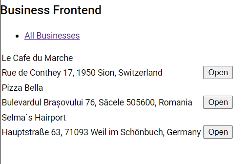
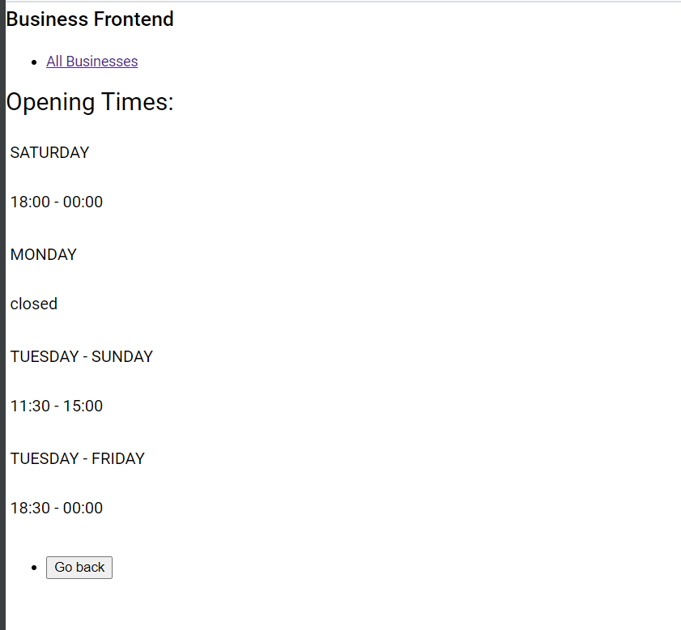

# Business

A backend service and API for a web application that shows information about a business entry like the business' name,
address and opening hours.

### Instructions

```
git clone https://github.com/KajcsaErno/arztekasse-assignment
cd business-backend
maven package
mvn clean install
mvn spring-boot:run
```

```
cd ..
cd business-frontend
npm install
ng serve --open
```

Open in browser: http://localhost:4200/allBusinesses





